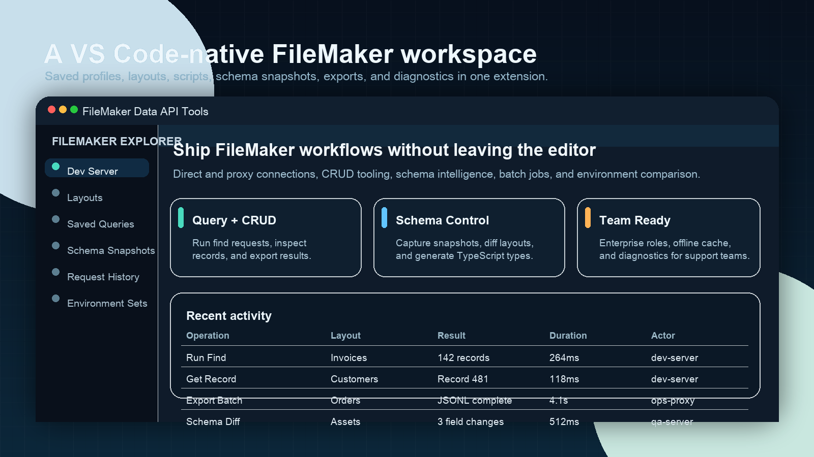
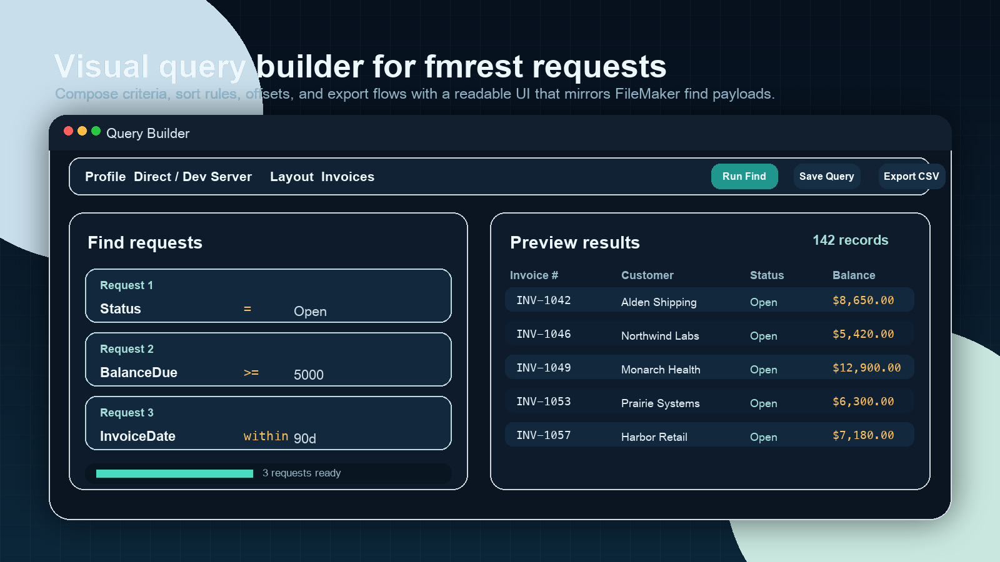
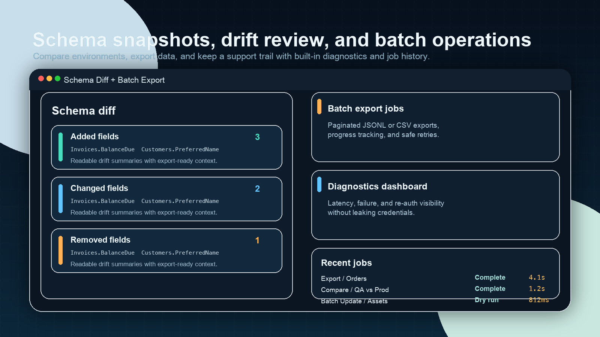

# FileMaker Data API Tools

FileMaker Data API Tools turns VS Code into a serious FileMaker workspace: connect to a FileMaker server, inspect layouts and metadata, run find requests, edit records, compare schema snapshots, export large result sets, and review diagnostics without leaving the editor.

Built for teams that already live in VS Code:

- Direct and proxy connection modes
- Visual query builder plus raw JSON find requests
- Full CRUD workflows for records
- Schema snapshots, diffing, and generated TypeScript types
- Batch export/update jobs and request history
- Enterprise controls, offline metadata mode, and safe plugin hooks
- No telemetry and no required cloud account

## Product Tour



The explorer keeps profiles, layouts, saved queries, schema snapshots, request history, environment sets, and diagnostics in one sidebar workflow.



The query builder gives you a readable UI for FileMaker find payloads, saved queries, result previews, and export actions.



Capture schema snapshots, review drift between environments, and run batch exports with job status and diagnostics built in.

## Install

### From the VS Code Marketplace

1. Open the Extensions view in VS Code.
2. Search for `FileMaker Data API Tools`.
3. Select **Install**.
4. Reload the window if VS Code prompts you.

### From a VSIX

1. Download `filemaker-data-api-tools-1.0.0.vsix`.
2. Run **Extensions: Install from VSIX...** from the Command Palette.
3. Select the VSIX file and reload the window.

## Quick Start

### Connect with direct mode

1. Run **FileMaker: Add Connection Profile**.
2. Choose a profile name such as `Dev Server`.
3. Select **Direct**.
4. Enter the FileMaker server URL, database name, and credentials.
5. Run **FileMaker: Connect**.

Credentials stay in VS Code `SecretStorage`; they are never written to workspace settings or logs.

### Connect with proxy mode

1. Run **FileMaker: Add Connection Profile**.
2. Select **Proxy**.
3. Enter the FileMaker server URL, database name, and your proxy endpoint.
4. Add an API key if your proxy requires one.
5. Run **FileMaker: Connect**.

### Run your first query

1. Run **FileMaker: Open Query Builder**.
2. Pick a layout.
3. Add one or more find requests.
4. Click **Run Find**.
5. Review the result table or export the result set.

## Feature Highlights

### Query, records, and scripts

- Run FileMaker find requests with JSON or the visual query builder
- Open, create, edit, and delete records from within VS Code
- Save reusable queries and execute them from the explorer
- Run FileMaker scripts with parameters and inspect results

### Schema and generation

- Browse layout fields and value lists in the explorer
- Capture schema snapshots and diff drift over time
- Compare layouts across environments
- Generate TypeScript types and snippets from layout metadata

### Scale and operations

- Export large result sets to JSONL or CSV
- Run batch update jobs with dry-run defaults
- Review request history, latency, re-auth events, and diagnostics
- Use offline metadata mode when a server is unavailable

### Security and governance

- Secrets stored only in VS Code `SecretStorage`
- Authorization headers and credentials are redacted in logs and copy-as helpers
- Workspace trust and role guards protect write workflows
- Webviews use CSP nonces and do not call FileMaker endpoints directly

## Common Commands

| Command | Purpose |
| --- | --- |
| `FileMaker: Add Connection Profile` | Create a new direct or proxy connection |
| `FileMaker: Connect` | Start a session with a saved profile |
| `FileMaker: Open Query Builder` | Build and run FileMaker find requests |
| `FileMaker: Open Record Editor` | Edit a record with preview support |
| `FileMaker: Create Record` | Create a new record on a layout |
| `FileMaker: Delete Record` | Delete a record with confirmation |
| `FileMaker: Capture Schema Snapshot` | Save metadata for later diffing |
| `FileMaker: Diff Schema Snapshots` | Compare two snapshots side by side |
| `FileMaker: Batch Export (Find)` | Export JSONL or CSV from a find request |
| `FileMaker: Show Request History` | Review prior API requests and status |

## Development

```bash
npm install
npm run lint
npm run typecheck
npm test
npm run package:check
```

`npm run package:check` produces a VSIX in `artifacts/` using the same metadata and image URLs that the Marketplace pipeline uses.

Additional project docs:

- [User Guide](./docs/USER_GUIDE.md)
- [Architecture](./ARCHITECTURE.md)
- [Contributing](./CONTRIBUTING.md)
- [Security](./SECURITY.md)
- [Upgrade Guide](./UPGRADE.md)

## License

MIT
